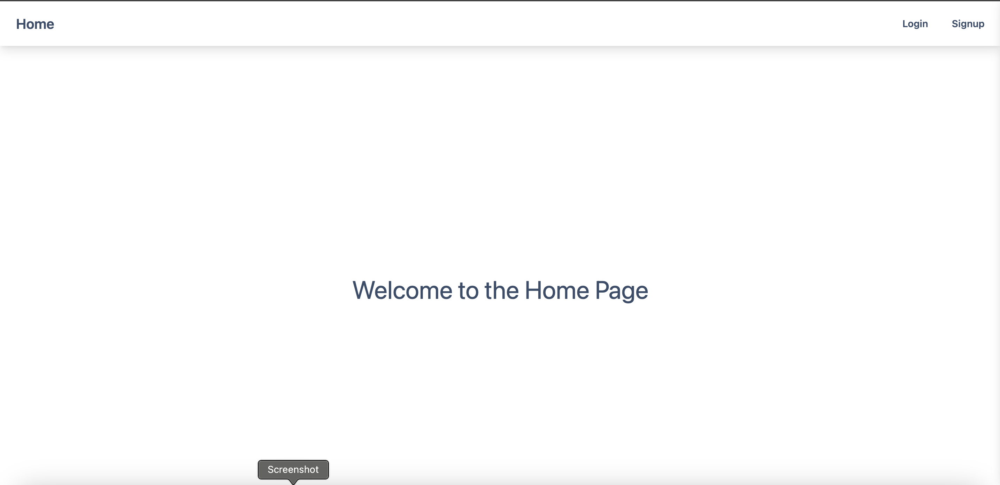
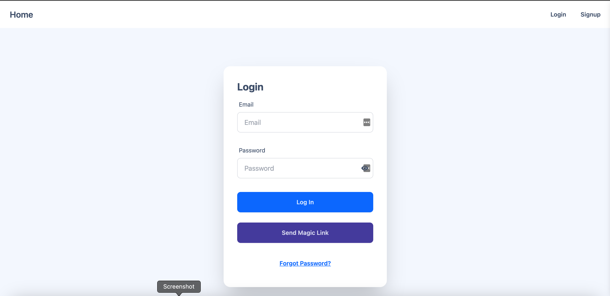
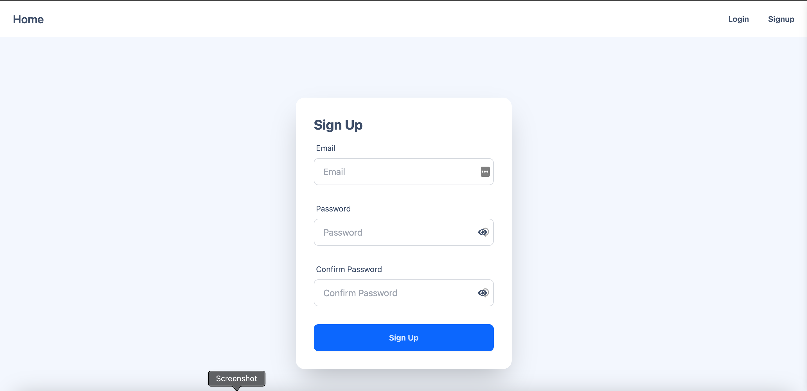
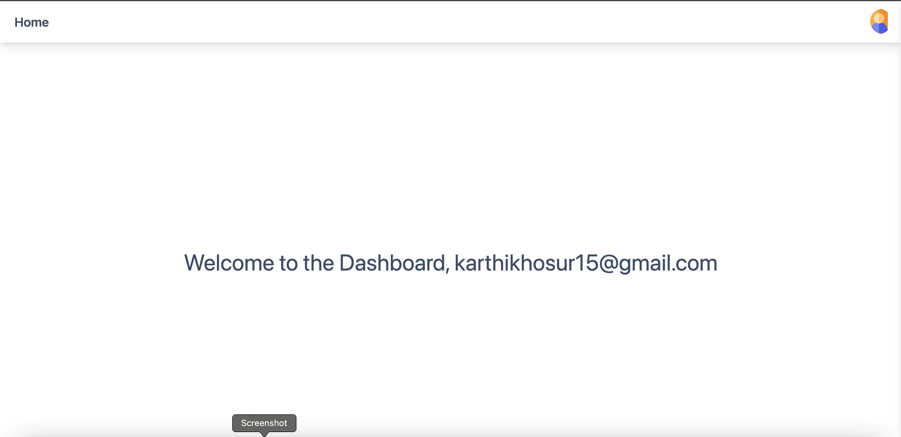

# Next.js + DaisyUI + TailwindCSS + Supabase Starter App

This is a starter app built with **Next.js**, **DaisyUI**, **TailwindCSS**, and **Supabase**. It provides a basic setup for authentication and user profile management, including functionalities to update user profile details, change passwords, and deactivate accounts.

## ✨ Features

- **Authentication with Supabase**
- **Profile management**
- **Password update functionality**
- **Account deactivation**
- **Styled with DaisyUI and TailwindCSS**

## 📸 Screenshots


### Home Page


### Login Page


### Signup Page


### Dashboard Page



## 🚀 Setup and Installation

### Prerequisites

- Node.js installed on your machine
- Supabase account and project setup

### Installation

1. **Clone the repository:**
    ```bash
    git clone https://github.com/your-username/nextjs-daisy-tailwind-supabase-starter.git
    cd nextjs-daisy-tailwind-supabase-starter
    ```

2. **Install the dependencies:**
    ```bash
    npm install
    ```

3. **Setup environment variables:**

    Create a `.env.local` file in the root directory and add your Supabase credentials:
    ```env
    NEXT_PUBLIC_SUPABASE_URL=your-supabase-url
    NEXT_PUBLIC_SUPABASE_ANON_KEY=your-supabase-anon-key
    ```

4. **Run the development server:**
    ```bash
    npm run dev
    ```
    Open [http://localhost:3000](http://localhost:3000) with your browser to see the result.

## 📖 Usage

### Authentication

- **Sign Up:** Users can sign up using their email and password.
- **Login:** Users can log in with their email and password.

### Profile Management

- **Profile Management:** Users can view their profile details, update their name, and change their password.
- **Account Deactivation:** Users can deactivate their account, which sets their account to inactive and logs them out.

### Profile Management

The profile page allows users to update their name and password. The email field is prepopulated and read-only. Users can choose to update their password by clicking the "Update Password" button.

### Account Deactivation

Users can deactivate their account by clicking the "Deactivate My Account" button. A confirmation popup will appear to confirm the action. If confirmed, the account is marked as inactive and the user is logged out.

## 🤝 Contributing

If you have suggestions for improving this project, please feel free to open an issue or submit a pull request.

## 📄 License

This project is licensed under the MIT License. See the [LICENSE](./LICENSE) file for more details.
Feel free to customize the content further as needed! 🎉
